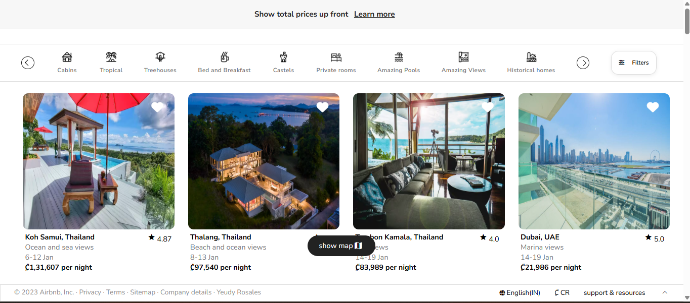

# 🏡 Clon de Airbnb - Proyecto Personal

Este proyecto es un clon funcional del sitio web de Airbnb, creado como ejercicio de aprendizaje para practicar el desarrollo web full-stack utilizando tecnologías modernas como React, Next.js y Tailwind CSS.

## 📸 Vista previa

## 🚀 Tecnologías utilizadas

- **Next.js** – Framework de React para renderizado del lado del servidor y rutas dinámicas.
- **React** – Biblioteca para construir interfaces de usuario basadas en componentes.
- **Tailwind CSS** – Framework CSS para diseño rápido y responsivo con clases utilitarias.
- **Mapbox API** – Para integrar mapas interactivos con geolocalización.
- **React Date Range Picker** – Selector de fechas para búsquedas de hospedaje.
- **Heroicons / Image Optimization** – Iconografía moderna y manejo eficiente de imágenes.

## 🧠 Aprendizajes clave

Durante el desarrollo de este proyecto, adquirí experiencia y reforcé conocimientos en:

- 🌐 **Desarrollo Frontend** con React y componentes personalizados.
- 🎯 **Gestión de rutas dinámicas** usando `Next.js` y `useRouter`.
- 🗺️ **Integración de APIs externas** como Mapbox, y uso seguro de claves de entorno.
- 📱 **Responsive Design** adaptando el sitio para móviles, tablets y escritorio.
- 💡 **Experiencia de usuario (UX)** con filtros dinámicos, selección de fechas y búsqueda contextual.
- ⚙️ **Optimización y despliegue** de aplicaciones web modernas.

## ✨ Funcionalidades

- Página de inicio con barra de búsqueda animada.
- Selector de rango de fechas para check-in y check-out.
- Visualización de resultados de búsqueda con datos simulados.
- Mapa interactivo que muestra ubicaciones de hospedajes.
- Diseño responsivo y limpio inspirado en Airbnb.

## 📁 Estructura del proyecto

